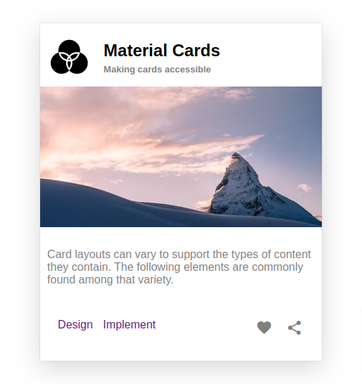

# Material Card

## Context

Material is an adaptable system of guidelines, components, and tools that support the best practices of user interface design. Backed by open-source code, Material streamlines collaboration between designers and developers, and helps teams quickly build beautiful products.

A material card is a sheet of material that may contain a photo, text, and a link about a single subject. They may display content containing elements of varying size, such as photos with captions of variable length.

## Problem Statement

Create a Card layout based on material design using CSS float property and position properties which resembles the following image.

### Tasks

- To build the solution for this practice, define styles in style.css located in the css folder of the boilerplate code.​

- Following table lists the recommended CSS style properties required for creating material card:​

| CSS Property | Brief Description | Acceptabe values|
|--------------|-------------------|------------------|
| float| Places an element on the left or right side of its container, allowing text and inline elements to wrap around it.| left,right,none|
|position| Sets how an element is positioned in a document. | static,relative,abccolute,fixed|
|box-shadow|Can be used to add shadow to the element's boxes. |Components of this property:​inset, offset-x, offset-y, blur-radius, spread-radius, color

- ​CSS spacing properties (margin and padding), and color properties (background-color, color) can be used to style the HTML element to generate a card layout​.

### Details

- Color codes used frequently used in the card
    - Gray (description and icon buttons)
    - Grey (subtitle)
    - #e4e4e4
    - Black (box-shadow)

- Font family list used in creating the card
    - Franklin Gothic Medium, Arial Narrow, Arial, san-serif